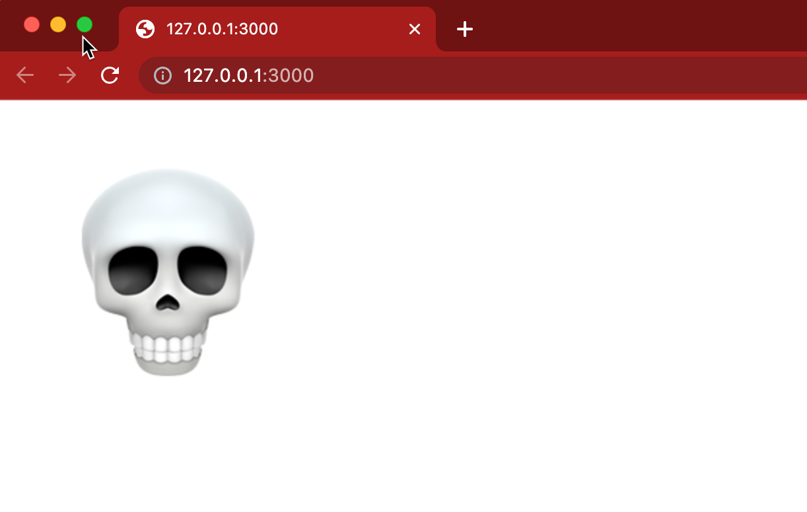

# Project 3

## Overview

In this lab, you will write some JavaScript to animate the movement of an image.
Your code will move the image to the location where the mouse clicks, as shown
in the example below.

## Project links

* [Video Walkthrough](https://youtu.be/1EGi-tHjMZo)
* [Grading Rubric](https://shanepanter.com/teaching/universal-grading-rubric.html)

## Task 1 - Author HTML

You will need to update the given index.html to include both the skull.png
image and the file main.js. Add an inline CSS rule on the `````` tag to use absolute
[positioning](https://developer.mozilla.org/en-US/docs/Web/CSS/position) with a
[left](https://developer.mozilla.org/en-US/docs/Web/CSS/left) value of **50px**
and a [top](https://developer.mozilla.org/en-US/docs/Web/CSS/top) value of
**50px**.

Your webpage should look like the image shown below.



## Task 2 - Animate the Image

When the user clicks anywhere in the page, the startAnimation() function is
called. startAnimation() determines where the user clicked and calls moveImage()
with the clicked (x, y) coordinate. The function moveImage() moves the skull 1
pixel in the direction of the given (x, y) coordinates.

In the startAnimation() function you will need to stop any previous timers that
were set so make sure and save the return value from setInterval(). After the if
statement in startAnimation() that stops the timer (if necessary), start a new
timer that calls moveImage(x, y) every 10 milliseconds. Save the timer
ID in a global variable.

Finally, Add an if statement in moveImage() that stops the timer when the image
has reached its destination. The user should be able to click anywhere
in the browser, and the skull will slowly move to the clicked location. If the
user clicks on a new location before the skull arrives at the last location, the
skull will adjust course and move to the new location.

You will need to use the following functions to create an animation using
JavaScript.

* [setInterval()](https://developer.mozilla.org/en-US/docs/Web/API/setInterval)
* [clearInterval()](https://developer.mozilla.org/en-US/docs/Web/API/clearInterval)
* [querySelector()](https://developer.mozilla.org/en-US/docs/Web/API/Document/querySelector)
* [mouse events](https://developer.mozilla.org/en-US/docs/Web/API/MouseEvent)

You can determine the location of the image by getting the left and top values
as shown below.

```JavaScript
const img = document.querySelector("img");
// Determine location of image
let imgX = parseInt(img.style.left);
let imgY = parseInt(img.style.top);
```

You can update the location of the image by updating the top and left CSS
properties of the image. NOTE: You must move the image so it is **centered**
on the mouse click. 

```JavaScript
// Update image location
img.style.left = centerX + "px";
img.style.top = centerY + "px";
```

You can get the mouse location as follows:

```JavaScript
// Get mouse coordinates
let clickX = e.clientX;
let clickY = e.clientY;
```

## Task 3 - The details

Your project must follow the the rules outlined below:

* All images must be in the **img** dir
* All javascript files must be in the **js** dir
* Images must have a relative path (e.g. img/skull.png NOT /img/skull.png)
* Javscript files must have a relative path (e.g. js/main.js NOT /js/main.js)

## Task 4 - Complete the Retrospective

Once you have completed all the tasks open the file **Retrospective.md** and
complete each section that has a TODO label. Reference the grading rubric
for details on how this will be graded.

## Task 5 - Add, Commit, Push your code

Once you are finished you need to make sure that you have pushed all your code
to GitHub for grading! The Video walk through linked in the beginning of this
document will show you how to accomplish this task.

## Acceptance Criteria

* The animation works as described.
* All the instructor provided tests are passing
* (optional) You have written at least 1 HTML test of your own
* You have pushed your code to github for grading
